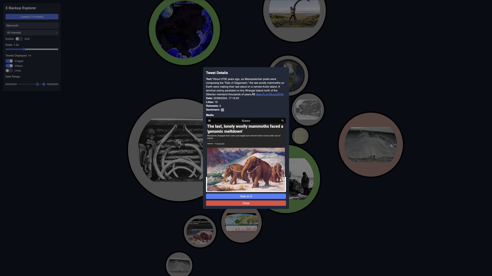

# Xplora - Twitter Backup Explorer


Xplora is a web application that allows users to explore and visualize their Twitter data backups. It provides a bubble or grid layout to display tweets, with filtering options for search queries, interests, date ranges, and media types (images, videos, links). The app includes sentiment analysis for tweets and supports both pre-loaded and user-uploaded Twitter data.

## Features

- **Interactive Visualization**: View tweets in a bubble or grid layout using D3.js.
- **Filtering**: Filter tweets by search query, interests, date range, and media types.
  - **Date Range Slider**: Adjust the date range with a dual-thumb slider, with updates deferred until the slider is released for better performance.
  - **Static Date Limits**: The date range slider always reflects the full dataset range, even after filtering.
- **Sentiment Analysis**: Visual representation of tweet sentiment using color gradients (red for negative, green for positive).
- **Media Support**: Display images and video thumbnails associated with tweets.
- **Pre-loaded Data**: Automatically loads `tweets.js` if present in the `public/` directory.
- **Dark Theme**: A consistent dark theme for better usability.
- **Wrapper Script**: A Bash script (`manage_app.sh`) to easily start, stop, reload, and check the status of both the backend and frontend servers.

## Project Structure

```
xplora/
├── .gitignore           # Git ignore file
├── README.md            # Project documentation
├── manage_app.sh        # Bash script to manage the app servers
├── main.py              # FastAPI backend server
├── index.html           # React frontend
├── public/              # Static assets
│   ├── tweets.js        # Optional: Preloaded tweets data
│   ├── output.css       # Tailwind CSS output
│   ├── favicon.ico      # Favicon for the app
│   └── lib/             # External JS libraries
│       └── react-window.umd.min.js
├── tweets_media/        # Empty directory for tweet media files (contains .gitkeep)
└── requirements.txt     # Python dependencies for the backend
```

## Prerequisites

- **Python 3.8+**: Required for the FastAPI backend.
- **Node.js**: Required for serving the frontend (via `serve`) and optional for rebuilding the frontend (e.g., precompiling JSX).
- **Git**: To clone and manage the repository.

## Setup Instructions

### 1. Clone the Repository

```bash
git clone https://github.com/nobulart/xplora.git
cd xplora
```

### 2. Set Up the Backend

#### Install Python Dependencies

Create a virtual environment and install the required packages:

```bash
python -m venv venv
source venv/bin/activate  # On Windows: venv\Scripts\activate
pip install -r requirements.txt
```

The `requirements.txt` includes dependencies like `fastapi`, `uvicorn`, `pandas`, `transformers`, `nltk`, and `chardet`.

#### (Optional) Pre-load Tweets Data

If you have a Twitter data backup (`tweets.js`), place it in the `public/` directory. The app will automatically load and process it on startup.

#### (Optional) Add Media Files

The `tweets_media/` directory is included in the repository as an empty folder with a `.gitkeep` file to ensure it exists. If your `tweets.js` file references media files, you should host them externally (e.g., on AWS S3) and update the `extract_media` function in `main.py` to use external URLs. Alternatively, for local testing, you can place the media files in `tweets_media/` with the correct naming convention (e.g., `tweets_media/<tweet_id>-<media_identifier>.<ext>`). These files should not be committed to the repository.

### 3. Set Up the Frontend

#### Install `serve`

Install `serve` globally using `npm` to serve the frontend static files:

```bash
npm install -g serve
```

### 4. Run the App (Backend and Frontend)

A Bash wrapper script (`manage_app.sh`) is provided to manage both the FastAPI backend server and the `serve` web server for the frontend.

#### Make the Script Executable

```bash
chmod +x manage_app.sh
```

#### Start Both Servers

```bash
./manage_app.sh start
```

This command starts:
- The FastAPI backend server on port 8000 (`http://127.0.0.1:8000`).
- The `serve` web server on port 3000 (`http://127.0.0.1:3000`), serving the `public/` directory.

#### Other Commands

- **Stop the Servers**:
  ```bash
  ./manage_app.sh stop
  ```
- **Reload the Servers** (stop then start):
  ```bash
  ./manage_app.sh reload
  ```
- **Check Status**:
  ```bash
  ./manage_app.sh status
  ```

Logs are written to:
- `app.log` (FastAPI backend).
- `serve.log` (frontend web server).

#### Option: Precompile the Frontend (Recommended for Production)

For better performance, precompile the JSX code instead of using in-browser Babel:

1. Set up a Node.js project:

   ```bash
   npm init -y
   npm install @babel/core @babel/preset-react babel-loader webpack webpack-cli --save-dev
   ```

2. Create a `webpack.config.js`:

   ```javascript
   const path = require('path');

   module.exports = {
     mode: 'production',
     entry: './index.js', // You'll need to extract the script from index.html
     output: {
       path: path.resolve(__dirname, 'dist'),
       filename: 'bundle.js',
     },
     module: {
       rules: [
         {
           test: /\.jsx?$/,
           exclude: /node_modules/,
           use: {
             loader: 'babel-loader',
             options: {
               presets: ['@babel/preset-react'],
             },
           },
         },
       ],
     },
   };
   ```

3. Extract the `<script type="text/babel">` content from `index.html` into a new `index.js` file, then update `index.html` to load the compiled bundle:

   ```html
   <script src="/dist/bundle.js"></script>
   ```

4. Build the frontend:

   ```bash
   npx webpack
   ```

5. Use the wrapper script to start the app as described above (`./manage_app.sh start`).

### 5. Access the App

Open your browser and navigate to `http://127.0.0.1:3000`. The app will automatically fetch pre-processed tweets from the backend (at `http://127.0.0.1:8000`) if `tweets.js` is present or allow you to upload a `tweets.js` file manually.

## Usage

- **Upload Tweets**: Click the "Upload" button to upload a `tweets.js` file from your Twitter data backup.
- **Filter Tweets**:
  - Use the search bar to filter tweets by text or user mentions.
  - Select an interest from the dropdown to filter by hashtags or mentions.
  - Adjust the date range slider to filter tweets by date (updates apply on mouse release for better performance).
  - Toggle filters for images, videos, or links.
- **Switch Layout**: Toggle between "Bubble" (interactive D3.js visualization) and "Grid" (tile-based view) layouts.
- **View Tweet Details**: Click on a tweet to view its full details, including text, media, sentiment, and links to the original tweet on Twitter.

## API Endpoints

The backend (`main.py`) provides the following endpoints:

- **POST `/upload`**: Upload a `tweets.js` file to process and store tweets.
- **GET `/tweets`**: Retrieve filtered tweets. Query parameters:
  - `query`: Search term (string)
  - `interest`: Filter by interest (string)
  - `dateStart`: Start date (timestamp in milliseconds)
  - `dateEnd`: End date (timestamp in milliseconds)
  - `showImages`: Filter for tweets with images (boolean)
  - `showVideos`: Filter for tweets with videos (boolean)
  - `showLinks`: Filter for tweets with links (boolean)

## Development Status (as of May 19, 2025)

As of May 19, 2025, Xplora is fully functional with the following recent improvements:
- **Static Date Limits**: The date range slider now maintains the full dataset range, even after applying filters.
- **Performance Optimization**: The date range slider updates the chart only on mouse release, reducing unnecessary API calls.
- **UI Improvement**: Adjusted z-index to ensure date range slider thumbs are interactable over the range indicator.
- **Wrapper Script**: Added `manage_app.sh` to easily start, stop, reload, and check the status of both the backend (FastAPI) and frontend (`serve`) servers.

### Planned Improvements
- **Frontend Precompilation**: Transition from in-browser Babel to a precompiled JavaScript bundle for better performance.
- **External Media Hosting**: Fully implement external hosting for media files (e.g., on AWS S3) to reduce repository size and improve scalability.
- **Pagination**: Add pagination to the `/tweets` endpoint to handle large datasets more efficiently.
- **Enhanced Visualization**: Add more interactive features to the D3.js bubble layout, such as tooltips and advanced zooming.

## Development

### Frontend
- The frontend is a single-page React app (`index.html`) using in-browser Babel for JSX compilation.
- Dependencies are loaded via CDNs (React, D3.js, Axios).
- Tailwind CSS is used for styling, with the compiled CSS in `public/output.css`.

### Backend
- The backend is a FastAPI server (`main.py`) that processes Twitter data and performs sentiment analysis using the `transformers` library.
- It serves API endpoints and can serve static files, though the `serve` web server is used for the frontend in the current setup.
- Tweets are pre-processed on startup if `public/tweets.js` exists.

### Adding Features
- **New Filters**: Add new query parameters to the `/tweets` endpoint in `main.py` and update the frontend to include corresponding UI elements.
- **Improved Visualization**: Enhance the D3.js bubble layout in `index.html` by adding more interactive features (e.g., tooltips, zooming).
- **Optimize Performance**: Implement pagination in the `/tweets` endpoint for large datasets.

## Deployment

### Local Deployment
Use the `manage_app.sh` script to run both the backend and frontend servers as described in the Setup Instructions.

### Cloud Deployment (e.g., Render)
The current setup uses two servers: the FastAPI backend and a `serve` web server for the frontend. For cloud deployment, you’ll need to deploy these separately or adjust the setup to serve everything through FastAPI.

#### Option 1: Deploy Both Servers Separately
1. **Backend (FastAPI) on Render**:
   - Push the repository to GitHub.
   - Create a Web Service on Render:
     - Select Python as the runtime.
     - Set the build command: `pip install -r requirements.txt`.
     - Set the start command: `uvicorn main:app --host 0.0.0.0 --port $PORT`.
     - Add an environment variable `PORT` (Render sets this automatically).
   - Note the deployed URL (e.g., `https://your-backend.onrender.com`).
2. **Frontend (`serve`) on Render**:
   - Create a second Web Service on Render:
     - Select Node.js as the runtime.
     - Set the build command: `npm install serve`.
     - Set the start command: `npx serve public -p $PORT`.
     - Add an environment variable `PORT` (Render sets this automatically).
   - Note the deployed URL (e.g., `https://your-frontend.onrender.com`).
3. **Update Frontend URLs**:
   - In `index.html`, replace `http://localhost:8000` with the backend URL (e.g., `https://your-backend.onrender.com`).
4. **Optimize Media Storage**:
   - Host media files (normally in `tweets_media/`) on a CDN or cloud storage (e.g., AWS S3) instead of including them in the repository. Update `main.py` to reference external URLs.

#### Option 2: Serve Everything Through FastAPI
To simplify deployment, you can serve the frontend through FastAPI (as it was originally set up) instead of using a separate `serve` web server:
1. **Modify `index.html`**:
   - Update API URLs to be relative (e.g., change `http://localhost:8000/tweets` to `/tweets`).
2. **Deploy on Render**:
   - Push the repository to GitHub.
   - Create a Web Service on Render:
     - Select Python as the runtime.
     - Set the build command: `pip install -r requirements.txt`.
     - Set the start command: `uvicorn main:app --host 0.0.0.0 --port $PORT`.
     - Add an environment variable `PORT` (Render sets this automatically).
   - The frontend will be available at `<deployed-url>/public/index.html`.
3. **Optimize Media Storage**:
   - As above, host media files on a CDN or cloud storage.

## Contributing

1. Fork the repository.
2. Create a new branch (`git checkout -b feature/your-feature`).
3. Make your changes and commit (`git commit -m "Add your feature"`).
4. Push to your branch (`git push origin feature/your-feature`).
5. Open a Pull Request.

## License

This project is licensed under the MIT License. See the [LICENSE](LICENSE) file for details.

## Acknowledgments

- Built with [FastAPI](https://fastapi.tiangolo.com/), [React](https://reactjs.org/), and [D3.js](https://d3js.org/).
- Sentiment analysis powered by [Hugging Face Transformers](https://huggingface.co/).
- Styling with [Tailwind CSS](https://tailwindcss.com/).
- Frontend serving with [serve](https://www.npmjs.com/package/serve).
</DOCUMENT>

---

### Changes Made
1. **Project Structure**:
   - Added `manage_app.sh` to the project structure diagram to reflect its inclusion.

2. **Features**:
   - Added the new wrapper script as a feature.
   - Updated the filtering section to mention the mouse-up delay, static date limits, and z-index improvements for the date range slider.

3. **Setup Instructions**:
   - **Removed `http-server`**: Replaced references to `http-server` with `serve`, since the wrapper script now uses `serve` for the frontend.
   - **Added Wrapper Script Instructions**: Updated the "Run the App" section to use `manage_app.sh` for starting both servers, including commands for starting, stopping, reloading, and checking status.
   - **Serve Installation**: Added a step to install `serve` globally, as required by the wrapper script.
   - **Precompile Option**: Kept the precompilation option but noted that the wrapper script can still be used after precompilation.

4. **Access the App**:
   - Updated the access URL to `http://127.0.0.1:3000`, reflecting the `serve` web server’s port.

5. **Development Status**:
   - Added recent improvements (static date limits, mouse-up delay, z-index adjustment, wrapper script) to the status section.

6. **Deployment**:
   - Added a detailed deployment section for the dual-server setup (FastAPI + `serve`).
   - Provided an alternative deployment option to serve everything through FastAPI, simplifying cloud deployment.

7. **Acknowledgments**:
   - Added `serve` to the list of acknowledged tools.

### Notes
- **Time Zone**: The README’s development status is dated May 19, 2025, at 03:44 PM SAST, as per the system timestamp.
- **Frontend URL**: The frontend is now served at `http://127.0.0.1:3000` by `serve`, but the backend API calls in `index.html` still point to `http://localhost:8000`. This is fine for local development but requires adjustment for cloud deployment (as noted in the Deployment section).
- **Precompilation**: The precompilation option remains optional, as the wrapper script works with the current in-browser Babel setup.
- **Deployment**: The dual-server setup (FastAPI + `serve`) is now the default for local development, but the deployment section offers a single-server option for production to simplify hosting.



